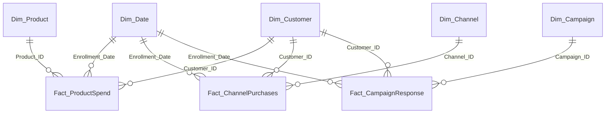

# Data Model Documentation

## Overview

This model follows the **Kimball star schema** methodology. A single flat CSV file has been decomposed into clearly separated **fact** and **dimension** tables, enabling clean relationships, efficient DAX, and intuitive report building.

## Why Kimball Star Schema?

- **Simplicity:** All relationships are one-to-many (1:M) from dimensions to facts — the pattern DAX is built to work with
- **Filter propagation:** Slicers on dimension tables (e.g., product, channel, campaign) automatically filter the correct fact table without ambiguity
- **Reusable dimensions:** `Dim_Customer` and `Dim_Date` are shared across all three fact tables, enabling cross-domain analysis from a single slicer
- **Scalable DAX:** Measures like `CALCULATE`, `REMOVEFILTERS`, and `RANKX` work naturally because the model has clean filter context flowing from dimensions → facts
- **No many-to-many headaches:** By decomposing the flat file into distinct fact tables with surrogate keys, every relationship is a clean 1:M join

## Schema Diagram

## Relationships

| From (Many Side) | To (One Side) | Key | Cardinality |
|---|---|---|---|
| Fact_ProductSpend | Dim_Product | `Product_ID` | Many : 1 |
| Fact_ProductSpend | Dim_Customer | `Customer_ID` | Many : 1 |
| Fact_ProductSpend | Dim_Date | `Enrollment_Date → Date` | Many : 1 |
| Fact_ChannelPurchases | Dim_Channel | `Channel_ID` | Many : 1 |
| Fact_ChannelPurchases | Dim_Customer | `Customer_ID` | Many : 1 |
| Fact_ChannelPurchases | Dim_Date | `Enrollment_Date → Date` | Many : 1 |
| Fact_CampaignResponse | Dim_Campaign | `Campaign_ID` | Many : 1 |
| Fact_CampaignResponse | Dim_Customer | `Customer_ID` | Many : 1 |
| Fact_CampaignResponse | Dim_Date | `Enrollment_Date → Date` | Many : 1 |

All relationships are **single-direction** (dimension filters fact).

## Table Summary

### Fact Tables

| Table | Grain | Measures Driven |
|---|---|---|
| **Fact_ProductSpend** | One row per customer per product category | Total Spend, Avg Spend per Customer, Product Rank |
| **Fact_ChannelPurchases** | One row per customer per channel | Total Purchases, Channel Rank, Web Purchase Share |
| **Fact_CampaignResponse** | One row per customer per campaign | Total Acceptances, Acceptance Rate, Campaign Rank |

### Dimension Tables

| Table | Role | Key Attributes |
|---|---|---|
| **Dim_Product** | Product category lookup (6 rows) | Product_ID, Product |
| **Dim_Channel** | Purchase channel lookup (4 rows) | Channel_ID, Channel |
| **Dim_Campaign** | Campaign lookup (6 rows) | Campaign_ID, Campaign |
| **Dim_Customer** | Customer demographics + derived attributes | Customer_ID, Age Group, Income Band, Relationship Status, Campaign Engagement, Children Status |
| **Dim_Date** | Calendar table for time intelligence | Date, Year, Month, Month Number |

### Utility Tables

| Table | Purpose |
|---|---|
| **_Measures** | Dedicated measures table (no data rows) — organizes all DAX measures by display folder |
| **_Data_Quality_Issues** | Filtered subset of customers flagged with data quality issues — supports transparency in reporting |

## Measures Organization

Measures are grouped into **display folders** within the `_Measures` table:

| Folder | Examples |
|---|---|
| **Core Metrics** | Total Customers, Total Spend, Total Purchases, Total Acceptances |
| **Data Quality** | Null Income Count, % Outliers, Clean Customer Count |
| **Customer Profile** | Avg Income, Median Income, Avg Age, Complaint Rate, % With Children |
| **Product Performance** | Avg Spend per Customer, Product % of Total Spend, Product Rank |
| **Channel Performance** | Avg Purchases per Customer, Channel % of Total, Channel Rank |
| **Campaign Effectiveness** | Acceptance Rate, Unique Accepted Customers, Campaign Rank |
| **Web Purchase Drivers** | Avg Web Purchases per Customer, Web Purchase Share, Web Visit to Purchase Ratio |

## Key Design Decisions

1. **Surrogate keys** (`Product_ID`, `Channel_ID`, `Campaign_ID`) are generated during Power Query transformation via index columns — this keeps fact tables lean and joins integer-based
2. **Shared dimensions** (`Dim_Customer`, `Dim_Date`) connect to all three fact tables, allowing a single slicer (e.g., age group or date) to filter across product spend, channel purchases, and campaign responses simultaneously
3. **Separate measures table** (`_Measures`) keeps the field list clean — all fact/dimension columns are hidden, and users interact only with named measures
4. **Data quality flags** are embedded in `Dim_Customer` and surfaced via a dedicated `_Data_Quality_Issues` table, making it easy to audit without cluttering the main analysis
